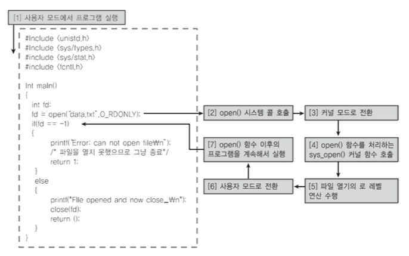
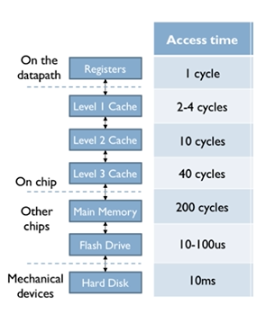
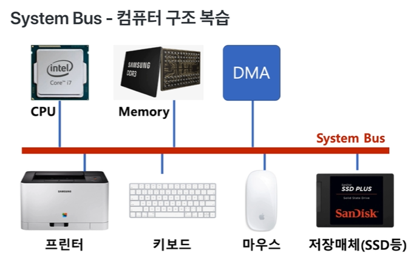

# 프로세스 스케쥴링
### 배치 처리 시스템, 시분할 시스템/멀티 프로그래밍
* 여러 프로그램을 순차적으로 실행시킬 수 있도록 해주세요 ( 배치 처리 시스템 )
  * 어떤 프로그램은 실행 시간이 오래 걸려서, 다른 프로그램이 실행하는데 시간을 많이 기다려야함
* MP3 음악을 들으면서, 문서 작성을 하고 싶어요 ( 동시에 여러 프로그램 실행 )
* 여러 사용자가 동시에 하나의 컴퓨터를 쓰려면 어떻게 해야 되나요? ( 다중 사용자 지원 )  
       ( 컴퓨터 응답 시간 )  

### 시분할 시스템
* 다중 사용자 지원을 위해 컴퓨터 응답시간을 최소화하는 시스템

### 멀티 태스킹
* 단일 CPU에서 여러 응용 프로그램이 동시에 실행되는 것처럼 보이도록 하는 시스템
   * MP3 음악을 들으며, 문서 작성을 하고 싶어요  
          | MP3(다음 MP3까지 음악을 만들어 놓음) | 문서 | MP3 | 문서 | ...
* 실제 멀티 태스킹
   * 1000 밀리초(ms) = 1초
        * 10 ~ 20ms 단위로도 실행 응용 프로그램이 바뀜
        * 사용자에게는 동시에 실행되는 것처럼 보임
    * 멀티 태스킹과 멀티 프로세싱
        * 멀티 태스킹 : 단일 CPU
        * 멀티 프로세싱 : 여러 CPU에 하나의 프로그램을 병렬로 실행해서, 실행속도를 극대화시키는 시스템

### 멀티 프로그래밍
 * 최대한 CPU를 많이 활용하도록 하는 시스템
    * 시간 대비 CPU 활용도를 높이자
    * 응용 프로그램을 짧은 시간 안에 실행 완료를 시킬 수 있음
 * 응용 프로그램은 온전히 CPU를 쓰기 보다, 다른 작업을 중간에 필요로 하는 경우가 많음
   * 응용 프로그램이 실행되다가 파일을 읽을 때 ( 저장매체 )  
           (1) 사용자 모드에서 프로그램 실행 (처음에 라이브러리 include)  
           (2) open() 시스템 호출  
           (3) 커널 모드로 전환  
           (4) open() 함수를 처리하는 sys_open() 커널 함수 호출  
           (5) 파일 열기의 로우레벨 연산 수행 ( 저장매체 'data.txt'를 읽을수 있는지 확인 )  
           (6) 사용자 모드로 전환  
           (7) open() 함수 이후의 프로그램을 계속해서 실행
   
      

   * 응용 프로그램이 실행되다가 프린팅을 할 때

     

   * System Bus 
     

