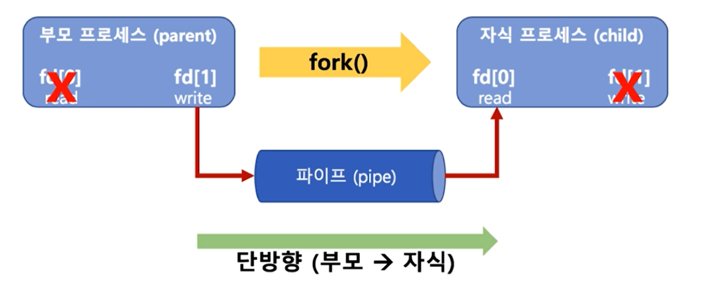
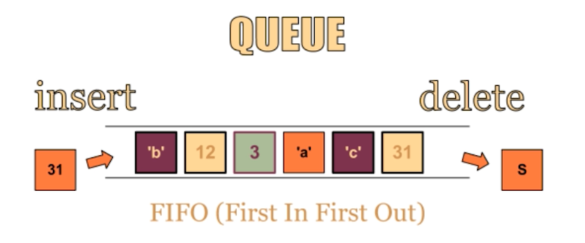
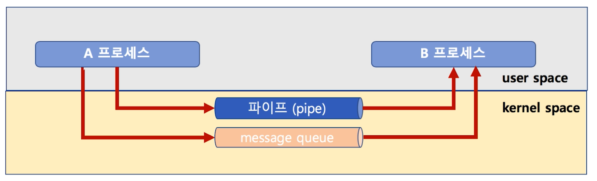
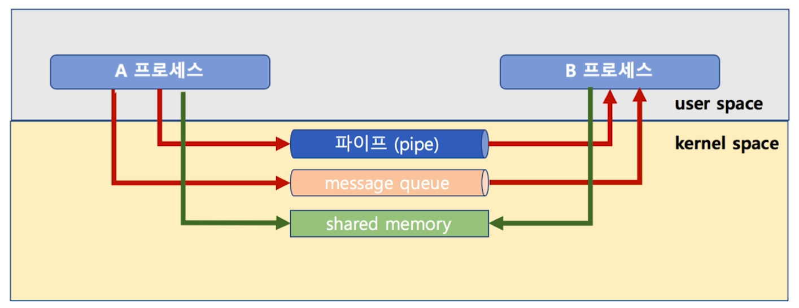
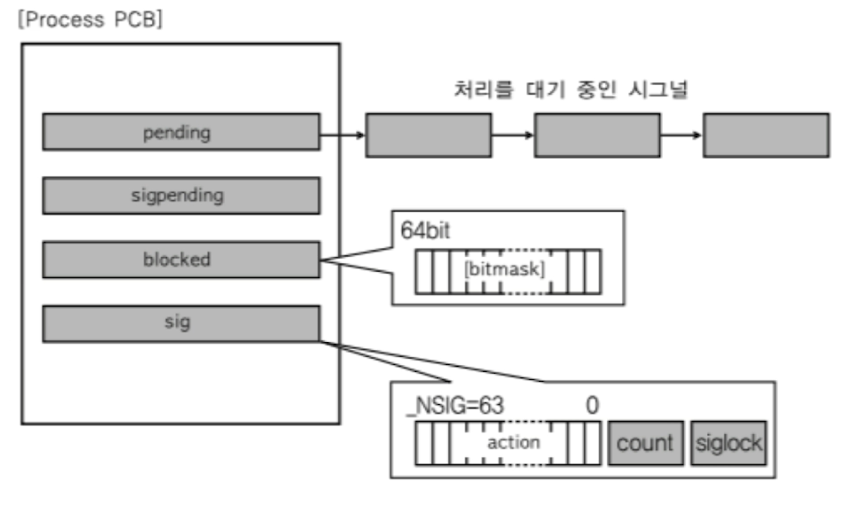
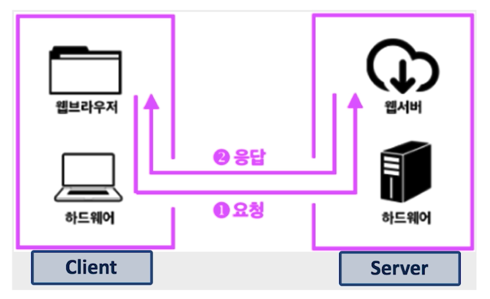
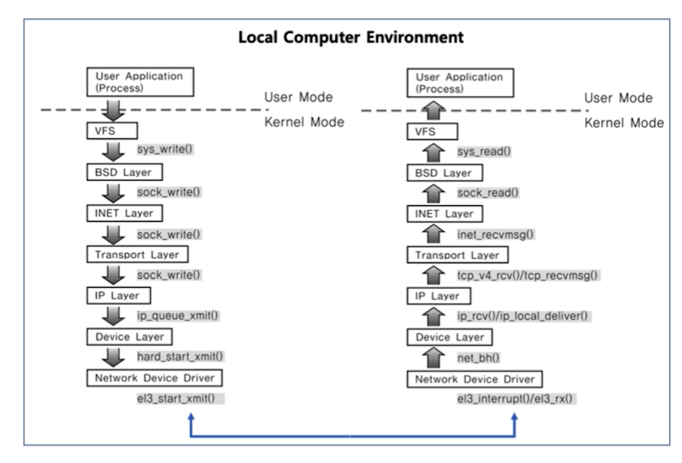

### 프로세스간 커뮤니케이션 (Inter Process Communication)
• 프로세스는 다른 프로세스의 공간을 접근할 수 없다  
• IPC(Inter Process Communication)
• 성능을 높이기 위해 여러 프로세스를 만들어서 동시 실행  
• 이 때 프로세스간 상태 확인 및 데이터 송수신이 필요  
• fork 시스템 콜  
* fork() 함수로 프로세스 자신을 복사해서 새로운 프로세스로 만들 수 있음

• 프로세스를  fork() 해서, 여러 프로세스를 동시에 실행 시킬 수 있음  
• 프로세스간 저장매체를 공유하여 할 수도 있음 ( 하지만 실시간으로 직접 원하는 프로세스에 데이터 전달이 어려움)

• 다양한 IPC 기법 (2번 부터는 커널공간(물리 메모리) 활용)
1. file 사용
2. Message Queue
3. Shared Memory
4. Pipe
5. Signal
6. Semaphore
7. Socket
8. ...

• 여러 프로세스 동시 실행을 통한 성능 개선, 복잡한 프로그램을 위한 프로세스간 통신 필요  
• 프로세스간 공간이 완전 분리  
• 프로세스간 통신을 위한 특별한 기법 필요(IPC)  
• 대부분의 IPC 기법은 결국 커널 공간을 활용하는 것(커널 공간은 공유하기 때문)

### 파이프 (PIPE)  
• 기본 파이프는 단방향 통신  
• fork() 로 자식 프로세스 만들었을 때, 부모와 자식간의 통신

 
    char* msg = "Hello Child Process!";
    int main()
    {
        char buf[255];
        int fd[2], pid, nbytes;

        if ( pipe(fd) < 0 ) // pipe(fd)로 파이프 생성
             exit(1);

        pid = fork(); // 이 함수 실행 다음 코드부터 부모/자식 프로세스로 나누어짐

        if ( pid > 0 ) { // 부모 프로세스는 pid에 실제 프로세스 ID가 들어감
             write(fd[1], msg, MSGSIZE); // fd[1]에 씁니다.
             exit(0);
        }

        else { // 자식 프로세스는 pid가 0이 들어감
            nbytes = read(fd[0], buf, MSGSIZE); // fd[0]으로 읽음
            printf("%d %s\n", nbytes, buf);
            exit(0);
        }

        return(0);
    }
        
### 메시지 큐(message queue)
•  FIFO 정책으로 데이터 전송

    
    •  A프로세스
    msqid = msgget(key, msgflg) // key는 1234, msgflg는 옵션
    msgsnd(msqid, &sbuf, buf_length, IPC_NOWAIT)

    •  B프로세스
    msqid = msgget(key, msgflg) // key는 동일하게 1234로 해야 해당 큐의 msgid를 얻을 수 있음
    msgrcv(msqid, &rbuf, MSGSZ, 1, 0) // &sbuf값을 &rbuf로 전달해줌  

#### 파이프와 메시지 큐
• message queue는 부모/자식이 아니라, 어느 프로세스간에라도 데이터 송수신이 가능  
• 먼저 넣은 데이터가 먼저 읽혀짐  
• pipe vs message queue (부모/자식 프로세스간 only or not, 단방향만 가능 or 양방향 가능)
    

### IPC 기법과 커널 모드
• pipe, message queue는 모두 kernel 공간의 메모리를 사용

### 공유 메모리(shared memory)
• 노골적으로 kernel space에 메모리 공간을 만들고, 해당 공간을 변수처럼 쓰는 방식  
• message queue 처럼 FIFO 방식이 아니라, 해당 메모리 주소를 마치 변수처럼 접근하는 방식  
• 공유메모리 key를 가지고, 여러 프로세스가 접근 가능  

1. 공유 메모리 생성 및 공유 메모리 주소 얻기  
`shmid = shmget((key_t)1234, SIZE, IPC_CREAT|0666))`  
`shmaddr = shmat(shmid, (void *)0, 0)`  
2. 공유 메모리에 쓰기  
`strcpy((char *)shmaddr, "Linux Programming")`
3. 공유 메모리에서 읽기  
`printf("%s\n", (char *)shmaddr)`

## IPC 기법 개념 이해하기(signal과 socket)
### 시그널
• 커널 또는 프로세스에서 다른 프로세스에 어떤 이벤트가 발생되었는지를 알려주는 기법
• 프로세스 관련 코드에 관련 시그널 핸들러를 등록, 해당 시그널 처리 실행
1. 시그널 무시
2. 시그널 블록(블록을 푸는 순간, 프로세스에 해당 시그널 전달)
3. 등록된 시그널 핸들러로 특정 동작 수행
4. 등록된 시그널 핸들러가 없다면, 커널에서 기본 동작 수행

* SIGKILL : 프로세스를 죽여라(슈퍼관리자가 사용하는 시그널로, 어떤 경우든 죽음)  
* SIGALARM : 알람을 발생   
* SIGSTP : 프로세스를 멈춰라  
* SIGCOUNT : 멈춰진 프로세스를 실행하라  
* SIGINT : 프로세스에 인터럽트를 보내서 프로세스를 죽여라  
* SIGSEGV : 프로세스가 다른 메모리 영역을 침범

• 시그널 핸들러 등록 및 핸들러 구현

    static void signal_handler (int signo) {
            printf("Catch SIGINT!\n");
            exit (EXIT_SUCCESS);
    }

    int main (void) {
            if (signal (SIGINT, signal_handler) == SIG_ERR) {
                printf("Can't catch SIGINT!\n");
                exit (EXIT_FAILURE);
            }

            for (;;)
                    pause();
            return 0;
    }

#### 시그널과 프로세스
• PCB에 해당 프로세스가 블록 또는 처리해야하는 시그널 관련 정보 관리

#### 소켓
* 소켓은 네트워크 통신을 위한 기술
* 기본적으로는 클라이언트와 서버 등, 두 개의 다른 컴퓨터 간의 네트워크 기반 통신을 위한 기술

#### 소켓과 IPC
* 소켓을 하나의 컴퓨터 안에서, 두 개의 프로세스간에 통신 기법으로 사용 가능

