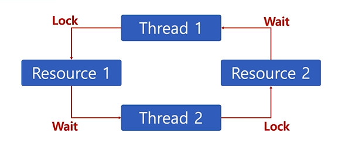

 ## Thread (스레드)
* Light Weight Process
* 프로세스
  * 프로세스 간에는 각 프로세스의 데이터 접근이 불가
* 스레드
  * 하나의 프로세스에 여러개의 스레드 생성 가능
  * 스레드들은 동시에 실행 가능
  * 프로세스 안에 있으므로, 프로세스의 데이터를 모두 접근 가능
  * 스레드는 각기 실행이 가능한 stack 존재
  

* 멀티 스레드 (Multi Thread)
  * 소프트웨어 병행 작업 처리를 위해 Multi Thread를 사용함
  

* 멀티 프로세싱과 thread
  * 멀티 태스킹과 멀티 프로세싱

### Thread 장점
  1. 사용자에 대한 응답성 향상
  
  2. 자원 공유 효율
     1. IPC 기법과 같이 프로세스간 자원 공유를 위해 번거로운 작업이 필요 없음
     2. 프로세스 안에 있으므로, 프로세스의 데이터를 모두 접근 가능
  3. 작업이 분리되어 코드가 간결

### Thread 단점
  1. 스레드 중 한 스레드만 문제가 있어도, 전체 프로세스가 영향을 받음
  
  
  2. 스레드를 많이 생성하면, Context Switching이 많이 일어나, 성능 저하
    * 스레드를 많이 생성하면, 모든 스레드를 스케쥴링해야 하므로, Context Switching이 빈번

#### Thread vs Process
* 프로세스는 독립적, 스레드는 프로세스의 서브셋
* 프로세스는 각각 독립적인 자원을 가짐, 스레드는 프로세스 자원 공유
* 프로세스는 자신만의 주소영역을 가짐, 스레드는 주소영역 공유
* 프로세스간에는 IPC 기법으로 통신해야 함, 스레드는 필요 없음

#### Thread 동기화 문제
* 동기화 : 작업들 사이에 실행 시기를 맞추는 것
* 여러 스레드가 동일한 자원(데이터) 접근시 동기화 이슈 발생
  * 동일 자원을 여러 스레드가 동시 수정시, 각 스레드 결과에 영향을 줌
##### Mutual exclusion(상호 배제)
* 쓰레드는 프로세스 모든 데이터를 접근할 수 있으므로,
  * 여러 스레드가 변경하는 공유 변수에 대해 Exclusive Access 필요
  * 어느 한 스레드가 공유 변수를 갱신하는 동안 다른 스레드가 동시 접근하지 못하도록 막아라
  * 임계 자원(critical resource)
  * 임계 영역(critical section)
##### Mutex와 세마포어 (semaphore)
* Critical Section(임계 구역)에 대한 접근을 막기 위해 Locking 매커니즘이 필요
  * Mutex (binary semaphore)
    * 임계 구역에 하나의 스레드만 들어갈 수 있음
  * Semaphore
    * 임계 구역에 여러 스레드가 들어갈 수 있음
    * counter를 두어서 동시에 리소스 접근할 수 있는 허용 가능한 스레드 수를 제어
    * P : 검사 (임계 영역에 들어갈 때)
      * S값이 1 이상이면, 임계 영역 진입 후, S값 1 차감(S값이 0이면 대기)
    * V : 증가 (임계 영역에서 나올 때)
      * S값을 1 더하고, 임계 영역을 나옴
    * S : 세마포어 값(초기 값만큼 여러 프로세스가 동시 임계 영역 접근 가능)
    
    * 바쁜 대기
      * wait()은 S가 0이면, 임계영역에 들어가기 위해, 반복문 수행(바쁜 대기, busy waiting)
    
    * 대기 큐
      * S가 음수일 경우, 바쁜 대기 대신, 대기큐에 넣는다
    
    * wakeup()
      * wakeup() 함수를 통해 대기큐에 있는 프로세스 재실행
    
    

#### Thread 교착상태(Deadlock)와 기아상태(Starvation)
* 교착상태(deadlock)
  * 무한 대기 상태 : 두 개 이상의 직업이 서로 상대방의 작업이 끝나기 만을 기다리고 있기 때문에, 다음단계로 진행하지 못하는 상태
  
  * 배치 처리 시스템에서는 일어나지 않는 문제
  * 프로세스, 스레드 둘다 이와 같은 상태가 일어날 수 있음
* 교착상태 발생 조건 (네 가지 조건이 모두 성립될 때, 교착상태 발생 가능성이 있음)
  1. 상호배제(Mutual exclusion) : 프로세스들이 필요로 하는 자원에 대해 배타적인 통제권을 요구함
  2. 점유대기(Hold and wait) : 프로세스가 할당된 자원을 가진 상태에서 다른 자원을 기다린다
  3. 비선점(No preempotion) : 프로세스가 어떤 자원의 사용을 끝낼 때까지 그 자원을 뺏을 수 없다
  4. 순환대기(Circular wait) : 각 프로세스는 순환적으로 다음 프로세스가 요구하는 자원을 가지고 있다

* 기아상태(starvation)
  * 특정 프로세스의 우선순위가 낮아서 원하는 자원을 계속 할당 받지 못하는 상태
  * 교착상태와 기아상태
    * 교착상태는 여러 프로세스가 동일 자원 점유를 요청할 때 발생
    * 기아상태는 여러 프로세스가 부족한 자원을 점유하기 위해 경쟁할 때, 특정 프로세스는 영원히 자원 할당이 안되는 경우를 주로 의미함
* 해결방안
  1. 프로세스 우선순위를 수시로 변경해서, 각 프로세스가 높은 우선순위를 가질 기회주기
  2. 오래 기다린 프로세스의 우선순위를 높여주기
  3. 우선순위가 아닌, 요청 순서대로 처리하는 FIFO 기반 요청큐 사용