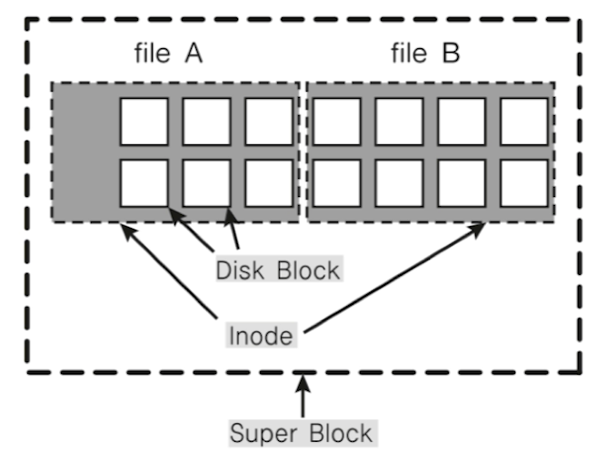
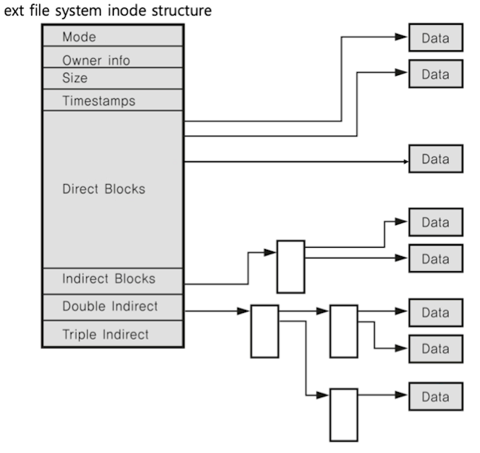
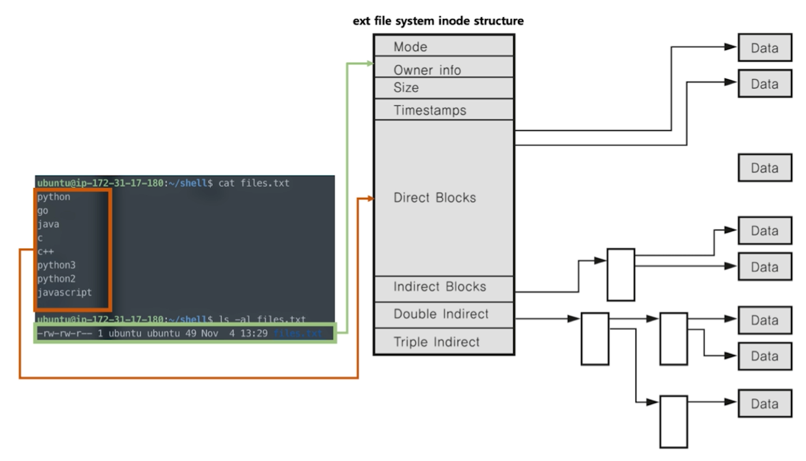
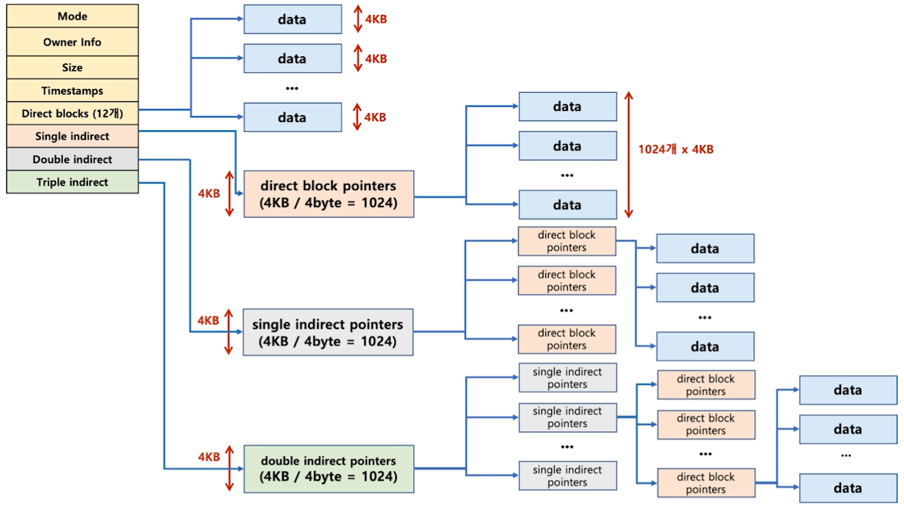
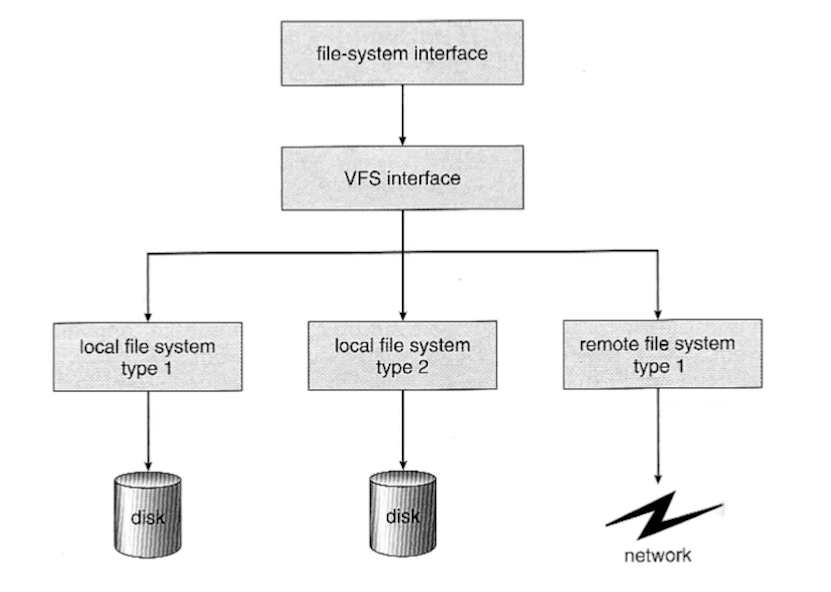

# 파일 시스템
  * 파일 시스템 : 운영체제가 저장매체에 파일을 쓰기 위한 자료구조 또는 알고리즘
  * 파일 시스템이 만들어진 이유(블록)
    * 0과 1의 데이터를 어떻게 저장매체에 저장할까
      * 비트로 관리하기는 오버헤드가 너무 큼
      * 블록 단위로 관리하기로 함(보통 4KB)
      * 블록마다 고유 번호를 부여해서, 관리
    * 사용자가 각 블록 고유 번호를 관리하기 어려움
      * 추상적(논리적) 객체 필요 : 파일
    * 사용자는 파일단위로 관리
      * 각 파일에는 블록 단위로 관리

  * 파일 시스템이 만들어진 이유 (저장 방법)
    * 저장 매체에 효율적으로 파일을 저장하는 방법
      * 가능한 연속적인 공간에 파일을 저장하는 것이 좋음
      * 외부 단편화, 파일 사이즈 변경 문제로 불연속 공간에 파일 저장 기능 지원 필요
        * 블록 체인 : 블록을 링크드 리스트로 연결
          * 끝에 있는 블록을 찾으려면, 맨 처음 블록부터 주소를 따라가야 함
        * 인덱스 블록 기법 : 각 블록에 대한 위치 정보를 기록해서, 한번에 끝 블록을 찾아갈 수 있도록 함

  * 다양한 파일 시스템
    * Windows : FAT, FAT32, NTFS
      * 블록 위치를 FAT라는 자료구조에 기록
    * 리눅스 : ext2, ext3, ext4
      * 일종의 인덱시 블록 기법인 inode 방식 사용

    * 파일 시스템과 시스템 콜
      * 동일한 시스템콜을 사용해서 다양한 파일 시스템 지원 가능토록 구현
        * read/write 시스템 콜 호출시, 각 기기 및 파일 시스템에 따라 실질적인 처리를 담당하는 함수 구현
          * ex) read_spec/write_spec
        * 파일을 실제 어떻게 저장할지는 다를 수 있음
          * 리눅스의 경우 ext4외 NTFS, FAT32 파일 시스템 지원
        
#### inode 방식 파일 시스템
* 파일 시스템 기본 구조
  * 수퍼 블록 : 파일 시스템 정보
  * 아이노드 블록 : 파일 상세 정보
  * 데이터 블록 : 실제 데이터 

* 수퍼 블록 : 파일 시스템 정보 및 파티션 정보 포함
* inode와 파일 :
  * 파일 : inode 고유값과 자료구조에 의해 주요 정보 관리
    * '파일이름:inode'로 파일 이름은 inode 번호와 매칭
    * 파일 시스템에서는 inode를 기반으로 파일 엑세스
    * inode 기반 메타 데이터 저장
    
  * inode 구조
    * inode 기반 메타 데이터(파일 권한, 소유자 정보, 파일 사이즈, 생선시간 등 시간 관련 정보, 데이터 저장 위치 등)
    
    
    
* 디렉토리엔트리
  * 리눅스 파일 탐색 : ex) -/home/ubuntu/ink.txt
    1. 각 디렉토리 엔트리(dentry)를 탐색
       * 각 엔트리는 해당 디렉토리 파일/디렉토리 정보를 가지고 있음
    2. '/' dentry 에서 'home'을 찾고, 'home'에서 'ubuntu'를 찾고, 'ubuntu'에서 link.txt 파일이름에 해당하는 inode를 얻음
    
* 가상 파일 시스템(Virtual File System)
  * Network등 다양한 기기도 동일한 파일 시스템 인터페이스를 통해 관리 가능
  * ex) read/write 시스템콜 사용, 각 기기별 read_spec/write_spec 코드 구현(운영체제 내부)
  
* 리눅스 운영체제와 가상 파일 시스템
  * 모든 것은 파일이라는 철학을 따름
    * 모든 인터렉션은 파일을 읽고, 쓰는 것처럼 이루어져 있음
    * 마우스, 키보드와 같은 모든 디바이스 관련된 기술도 파일과 같이 다루어짐
    * 모든 자원에 대한 추상화 인터페이스로 파일 인터페이스를 활용
  * 디바이스
    * 블록 디바이스(Block Device)
      * HDD, CD/DVD와 같이 블록 또는 섹터 등 정해진 단위로 데이터 전송, IO 송수신 속도가 높음
    * 캐릭터 디바이스(Character Device)
      * 키보드 마우스 등 byte 단위 데이터 전송, IO 송수신 속도가 낮음