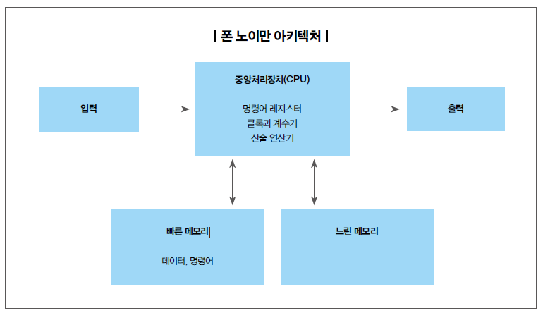
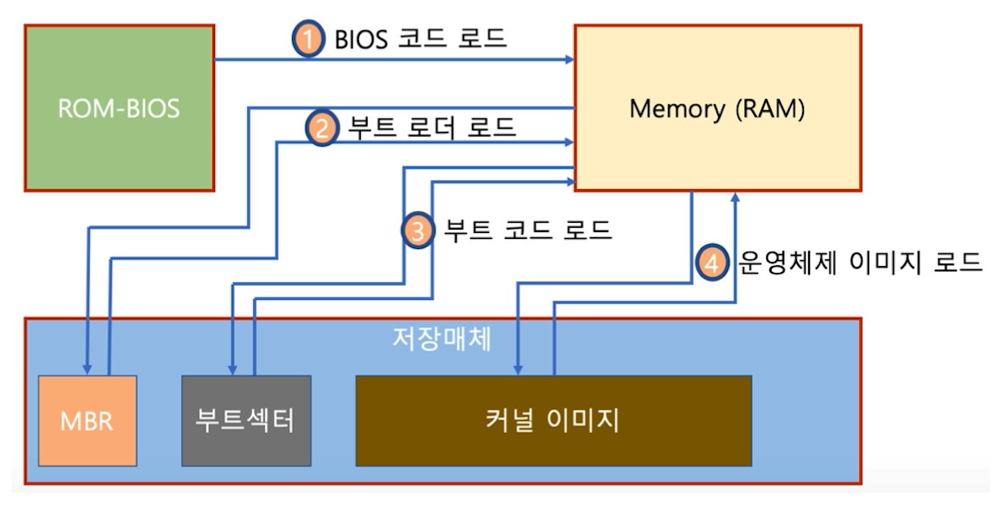
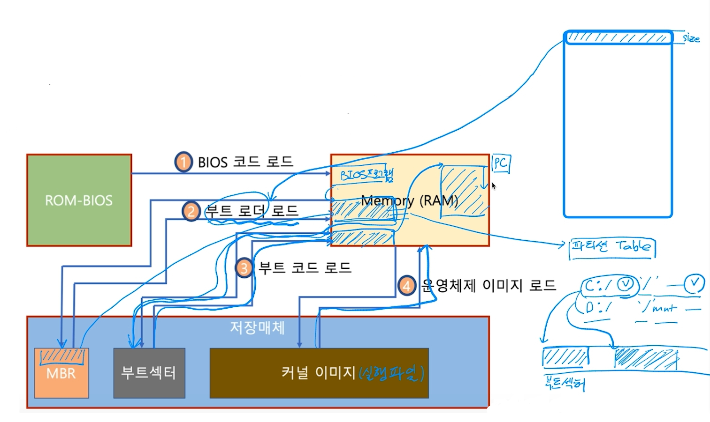

# Boot
* 컴퓨터를 켜서 동작시키는 절차
* Boot 프로그램
  * 운영체제 커널을 Storage에서 특정 주소의 물리 메모리로 복사하고 커널의 처음 실행위치로 PC를 가져다 놓는 프로그램
  * 폰 노이만 구조에서는 메모리에 코드를 실행시켜 CPU로
  
* 부팅 과정
  * 컴퓨터를 키면
    * BIOS가 특정 Storage를 읽어와 bootstrap loader를 메모리에 올리고 실행
    * bootstrap loader 프로그램이 있는 곳을 찾아서 실행시킴
    
    * 
    